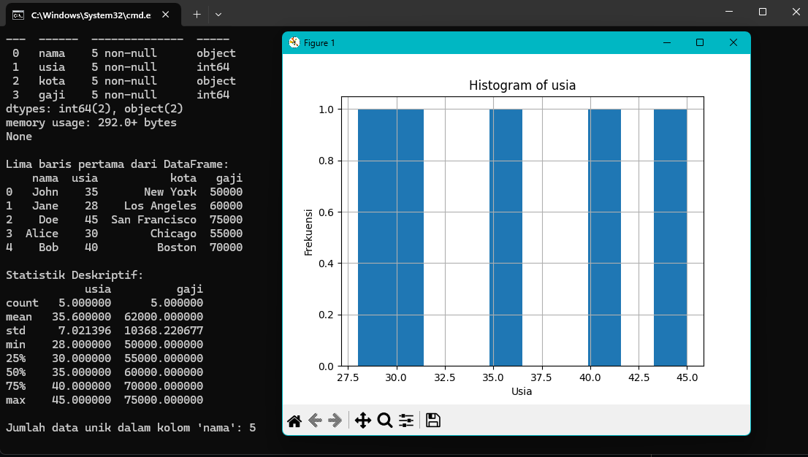

<h1 align="center">
  
  <br>
</h1>

# simple-big-data-analysis
simple big data analysis

## Installation
```
$ git clone github.com/X-Projetion/ParamSan/
```

# Run

$ cd simple-big-data-analysis

$ pip install -r requirements.txt

$ python3 main.py
